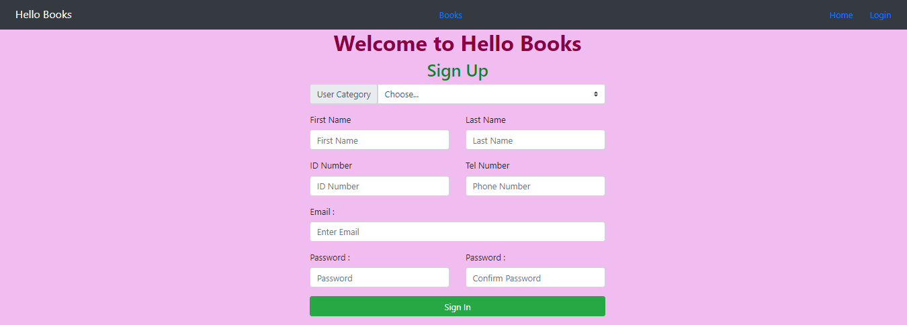
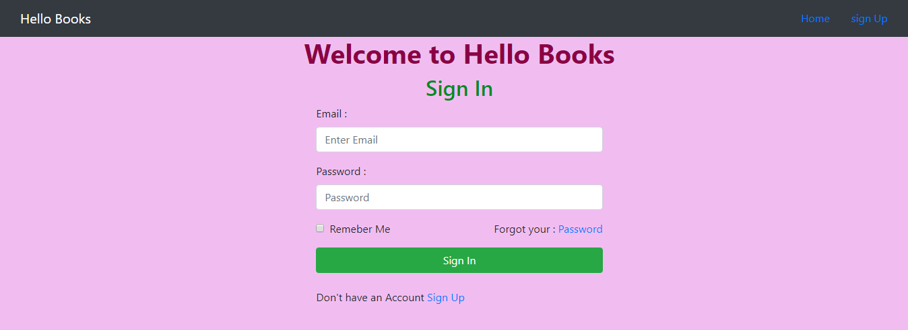
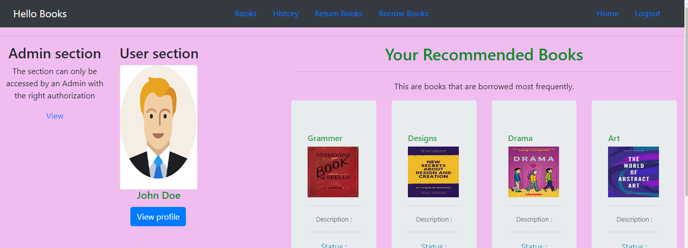

# Hello-Books

Hello-Books is a simple application that helps manage a library and its processes like stocking, tracking and renting books. The is the front-end part and the view the designs hosted in github pages you can click [Here](https://sam-karis.github.io/designs/UI/).   
The designs are not fully functional since the app is in the development stage but when fully developed the application should have the following features:  
- The homepage where the user or visitor can view and read about how the app works.
- The sign up page where an interested new user can register and have access to library services which include: *Renting*, *Borrowing* and *Returning*, *View profile* books with a click of a button.
- The app shall have two section the **Admin** and the **Normal User** section once you are login.   
**Admin section** - Shall only be active for the user registerd as the an admin and here you one can *Add, Delete,Edit a book*.   
**Normal user section** - This section is accessible to anyone registered as a user be it admin or other. Here you be able to *Renting*, *Borrowing* and *Returning*, *View profile*, *view your borrowing history*   
    

### The app dependencies
The front-end part depends on the following:
- HTML
- CSS
- Bootstrap 4.0.0
- jquery/3.3.1
   
### Set up and Install the App in your local machine
Perform the simple steps:   
- Open git and navigate to directory yo which to run the app from.
- Git clone the this repository using either.
  - Using SSH:
    
    ``git@github.com:sam-karis/Hello-Books.git``
  
  - Using HTTP:
    
    ``https://github.com/sam-karis/Hello-Books.git``

This is a preview of the home page.   

This is a preview of the signup page.  

This is a preview of the login page.  

This is a preview of the dashboard page this is the page are take after login.  

The back-end is under development and will to be set and working by next week.